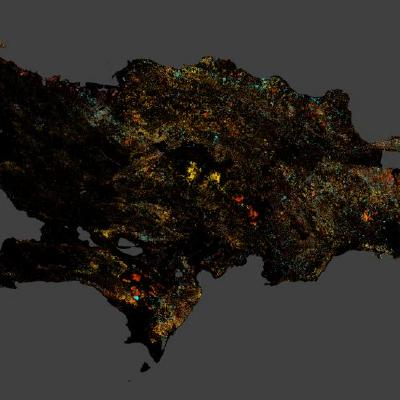

\pagebreak

```{r setup, include=FALSE}
knitr::opts_chunk$set(
  cache = FALSE,
  echo = FALSE,
  warning = FALSE,
  message = FALSE,
  dpi = 300,
  fig.align = "center",
  out.width = "100%"
)

options(
  knitr.duplicate.label = "allow",
  knitr.kable.NA = ""
)

# Aleatorización
set.seed(99)

# Paquetes
library(tidyverse)
library(knitr)
library(kableExtra)

# Tema general para gráficos ggplot2
theme_set(theme_bw())
```

# Introducción

Esta sección debes incluir las partes básicas que se supone debe contener una introducción. Apóyate en la [Guía para proyecto de investigación](https://biogeografia-master.github.io/proyecto-de-investigacion/guia-para-proyecto-de-investigacion.html) y en el mandato de la práctica. Aquí conviene redactar de forma fluida y apoyarse en referencias bibliográficas desde el inicio. Puedes usar citas indirectas: "La geomorfometría es una herramienta útil para la extracción de conclusiones geomorfológicas [@hengl2009geomorphometry; @anderson2010geomorphology]". También puedes usar citas narrativas, por ejemplo: "@anderson2010geomorphology discuten la importancia del tema en contextos comparables".

# Materiales y métodos

Esta sección debe describir con claridad los datos, materiales, procedimientos, criterios de selección, procesamiento y métodos de análisis. También es un buen lugar para incluir referencias bibliográficas que justifiquen decisiones metodológicas. En esta seción deben existir también citas, ya sean directas [@hengl2009geomorphometry] o narrativas.

Por ejemplo, los insumos utilizados pueden resumirse en la Tabla \@ref(tab:tabla-resumen), mientras que la Tabla \@ref(tab:tabla-manual) muestra un ejemplo de tabla escrita manualmente en Markdown.

## Ejemplo de tabla generada con `kableExtra`


```{r tabla-resumen}
tabla_ejemplo <- tibble(
  Material = c("Datos espaciales", "Software", "Bibliografía"),
  Descripcion = c(
    "Capas vectoriales y ráster usadas en el análisis",
    "R, RStudio y paquetes especializados",
    "Fuentes académicas empleadas como soporte"
  ),
  Uso = c(
    "Procesamiento y elaboración de figuras",
    "Análisis y generación de tablas",
    "Contextualización teórica y metodológica"
  )
)

kable(
  tabla_ejemplo,
  format = "latex",
  booktabs = TRUE,
  caption = "Resumen de materiales e insumos empleados en el estudio.",
  align = c("l", "l", "l")
) %>%
  kable_styling(
    latex_options = c("HOLD_position"),
    full_width = FALSE,
    font_size = 10
  ) %>%
  column_spec(2, width = "6cm") %>%
  column_spec(3, width = "4.5cm") %>%
  footnote(
    general = "Ejemplo de tabla generada con kableExtra.",
    general_title = "Nota:"
  )
```

## Ejemplo de tabla manual en Markdown

La Tabla \@ref(tab:tabla-manual) ilustra cómo escribir una tabla simple manualmente.


| Elemento        | Tipo      | Observación                      |
|:----------------|:----------|:---------------------------------|
| Área de estudio | Espacial  | Delimitación del sitio analizado |
| Variables       | Atributos | Variables medidas o derivadas    |
| Salidas         | Productos | Mapas, tablas y figuras          |

Table: (\#tab:tabla-manual) Tabla de ejemplo escrita manualmente en Markdown.

## Ejemplo de figura insertada desde archivo

Te explico cómo insertar figuras y referirlas apropiadamente (referencia cruzada). Este es un ejemplo de referencia cruzada: "En la Figura \@ref(fig:figura-archivo) se muestra una imagen insertada desde un archivo externo.".

Este es un ejemplo de inserción de figura desde archivo:

> Sustituye `"figura-ejemplo.jpg"` por la ruta real de tu imagen.

```{r figura-archivo, fig.cap="Figura de ejemplo insertada desde archivo externo.", out.width='100%'}

```


## Ejemplo de figura generada con código de R

Este es un ejemplo de referencia cruzada a una figura generada con código: "La Figura \@ref(fig:figura-codigo) muestra un gráfico sencillo producido con código reproducible de R".


```{r figura-codigo, fig.cap="Relación de ejemplo entre dos variables usando el conjunto de datos `mtcars`.", out.width='100%'}
ggplot(mtcars, aes(x = wt, y = mpg)) +
  geom_point() +
  labs(
    x = "Peso del vehículo",
    y = "Millas por galón"
    )
```

# Resultados

En esta sección se presentan los hallazgos de forma ordenada y directa. Los resultados no deben colocarse como salidas crudas de la consola de R, sino como redacción, tablas o figuras interpretables.

Por ejemplo, la Figura \@ref(fig:figura-codigo) sugiere una relación negativa entre el peso del vehículo y el rendimiento de combustible en este conjunto de datos de ejemplo. Del mismo modo, la Tabla \@ref(tab:tabla-estadisticos) resume algunos estadísticos descriptivos básicos.

## Ejemplo adicional de tabla de resultados

```{r tabla-estadisticos}
resumen_resultados <- mtcars %>%
  summarise(
    media_mpg = mean(mpg),
    sd_mpg = sd(mpg),
    media_wt = mean(wt),
    sd_wt = sd(wt)
  ) %>%
  pivot_longer(cols = everything(),
               names_to = "Estadistico",
               values_to = "Valor")

kable(
  resumen_resultados,
  format = "latex",
  booktabs = TRUE,
  digits = 2,
  caption = "Estadísticos descriptivos básicos del conjunto de datos de ejemplo.",
  col.names = c("Estadístico", "Valor")
) %>%
  kable_styling(
    latex_options = c("hold_position"),
    full_width = FALSE,
    font_size = 10
  )
```

# Discusión

La discusión interpreta los resultados, los relaciona con la literatura previa y plantea implicaciones, limitaciones y posibles líneas futuras de trabajo. Aquí también pueden incorporarse referencias bibliográficas [@anderson2010geomorphology].

Por ejemplo, si los hallazgos obtenidos coinciden con trabajos previos, puede indicarse explícitamente. Si difieren, debe discutirse por qué, considerando diferencias de escala, datos, métodos o contexto.

En una redacción normal, puedes hacer referencias cruzadas así:

* "Como se observa en la Figura \@ref(fig:figura-archivo)..."
* "Los materiales empleados se resumen en la Tabla \@ref(tab:tabla-resumen)..."
* "Los estadísticos descriptivos aparecen en la Tabla \@ref(tab:tabla-estadisticos)..."

# Guía sobre referencias cruzadas

## Cómo referir figuras generadas con código

Si un chunk se llama `figura-codigo`, la referencia cruzada se escribe así:

`Figura \@ref(fig:figura-codigo)`

El identificador es el nombre del chunk precedido por `fig:`.

## Cómo referir tablas generadas con `kable` o `kableExtra`

Si un chunk se llama `tabla-resumen`, la referencia cruzada se escribe así:

`Tabla \@ref(tab:tabla-resumen)`

El identificador es el nombre del chunk precedido por `tab:`.

## Cómo referir tablas escritas manualmente en Markdown

En tablas manuales, usa esta sintaxis al inicio del título:

`(\#tab:tabla-manual)`

Y luego cita así:

`Tabla \@ref(tab:mi-tabla)`

## Recomendación importante

En documentos **APA7 + bookdown**, para referencias cruzadas conviene usar `\@ref()` y no `\ref{}`.
Ejemplos:

* `Figura \@ref(fig:figura-codigo)`
* `Tabla \@ref(tab:tabla-resumen)`

# Referencias {-}
